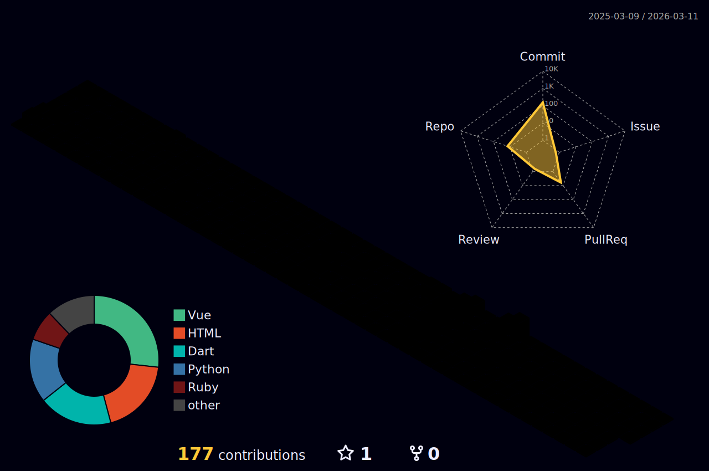

<p align="center">
  
<!--    -->
</p>

## 😏About Me
  - Name: Laiyong(Archie) Cheng
  - Gender: Male
  - Hometown: China
  - Education:
    - University of California, Riverside
    - Santa Clara University
  - Hobbies:
    - 🚶Hiking
    - 🌉Travelling
    - 🍚Cooking
    - ...
## 📈Coding Statistics
<p align = "center">
  
  
  
  
  
  
  <!--START_SECTION:waka-->

```txt
Python   1 hr 28 mins    ██████████████████████░░░   87.90 %
CSV      12 mins         ███░░░░░░░░░░░░░░░░░░░░░░   12.10 %
```

<!--END_SECTION:waka-->
</p>

## 💻Skills

  - ### Frontend <br />
    [](https://skillicons.dev)
  - ### Backend <br />
    [](https://skillicons.dev)
  - ### Development Tools <br />
    [](https://skillicons.dev)
  - ### Version Control <br />
    [](https://skillicons.dev)
  - ### API Test <br />
    [](https://skillicons.dev)
