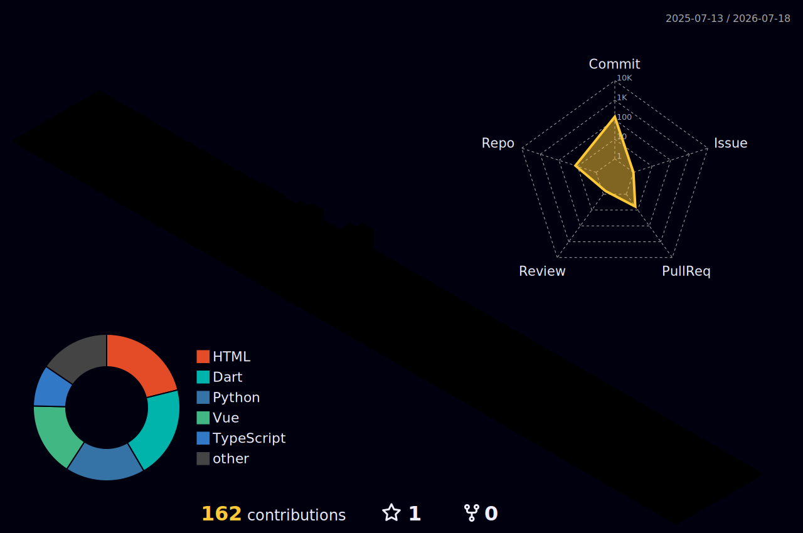

## 😏About Me
  - Name: Laiyong(Archie) Cheng
  - Gender: Male
  - Hometown: China
  - Education:
    - University of California, Riverside
    - Santa Clara University
  - Hobbies:
    - 🚶Hiking
    - 🌉Travelling
    - 🍚Cooking
    - ...
   
## 💻Skills

  - ### Frontend <br />
    [](https://skillicons.dev)
  - ### Backend <br />
    [](https://skillicons.dev)
  - ### Development Tools <br />
    [](https://skillicons.dev)
  - ### Version Control <br />
    [](https://skillicons.dev)
  - ### API Test <br />
    [](https://skillicons.dev)
## 📈Coding Statistics
<p align = "center">
  
  <!--START_SECTION:waka-->

```txt
TypeScript   3 hrs 6 mins          ███████████████▒░░░░░░░░░   61.43 %
Bash         52 mins               ████▒░░░░░░░░░░░░░░░░░░░░   17.42 %
Other        23 mins               ██░░░░░░░░░░░░░░░░░░░░░░░   07.84 %
JSON         18 mins               █▓░░░░░░░░░░░░░░░░░░░░░░░   06.03 %
Markdown     13 mins               █░░░░░░░░░░░░░░░░░░░░░░░░   04.56 %
```

<!--END_SECTION:waka-->
</p>

