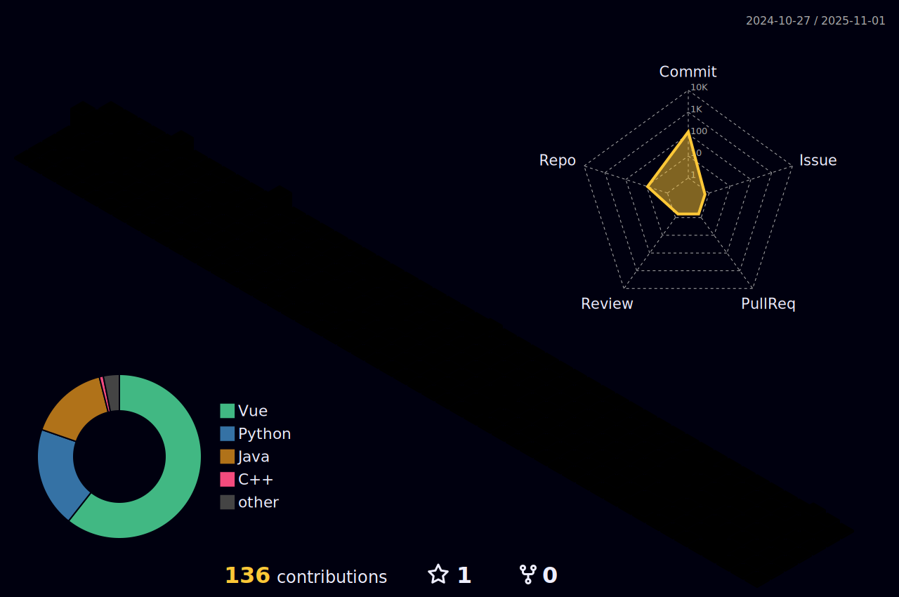

## 😏About Me
  - Name: Laiyong(Archie) Cheng
  - Gender: Male
  - Hometown: China
  - Education:
    - University of California, Riverside
    - Santa Clara University
  - Hobbies:
    - 🚶Hiking
    - 🌉Travelling
    - 🍚Cooking
    - ...
   
## 💻Skills

  - ### Frontend <br />
    [](https://skillicons.dev)
  - ### Backend <br />
    [](https://skillicons.dev)
  - ### Development Tools <br />
    [](https://skillicons.dev)
  - ### Version Control <br />
    [](https://skillicons.dev)
  - ### API Test <br />
    [](https://skillicons.dev)
## 📈Coding Statistics
<p align = "center">
  
  <!--START_SECTION:waka-->

```txt
HTML             3 hrs 36 mins   █████▓░░░░░░░░░░░░░░░░░░░   22.63 %
CSS              3 hrs 2 mins    ████▓░░░░░░░░░░░░░░░░░░░░   19.09 %
Vue.js           2 hrs 29 mins   ████░░░░░░░░░░░░░░░░░░░░░   15.58 %
Ruby             1 hr 6 mins     █▓░░░░░░░░░░░░░░░░░░░░░░░   06.92 %
SQL              1 hr            █▓░░░░░░░░░░░░░░░░░░░░░░░   06.33 %
```

<!--END_SECTION:waka-->
</p>

